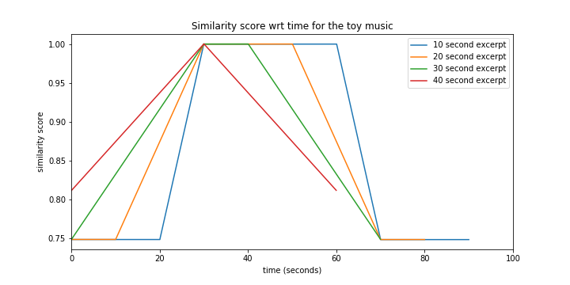

# Music analysis and transformations

This repository contains all my work related to music done at the MVA master (2020). 

The folder music_summarization is a project realized for the course 'Audio Signal Processing', taught by Emmanuel Bacry, tackling the issue of extracting an excerpt of a few seconds (e.g. 10) representative of a whole musical piece. 

The other folders were done during the lessons of Gaël Richard and Roland Badeau ('Audio Signal Analysis, Indexing, and Transformations'). The folder sound_effects gathers 3 interesting and common sound effects: flanger, phasing, and reverberations. In the folder musical_notes_detection, as suggested by its name, we provide an algorithm trying to discover which musical notes have been played, given a short sound excerpt. The folder ESPRIT_and_MUSIC contains an analysis and a synthesis of bell sounds thanks to the MUSIC (MUltiple SIgnal Classification) and ESPRIT (Estimation of Signal Parameters via Rotational Invariance Technique) algorithms, both based on nice linear algebra. 

Enjoy!

